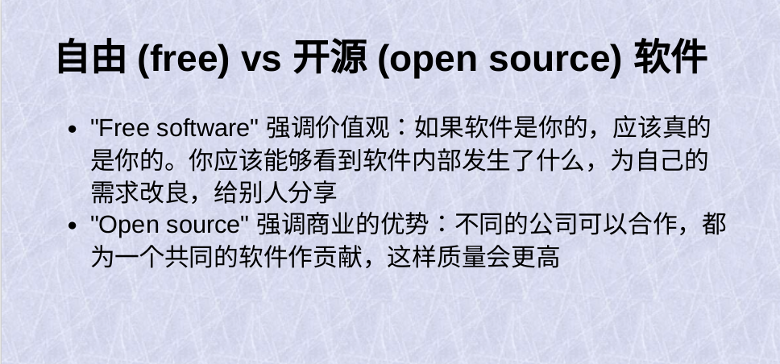
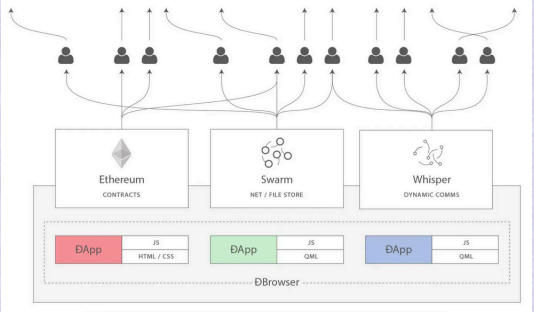

### Web3 怎么继承开源自由软件的理念 - Vitalik Buterin - 第九届中国开源年会

来源： https://www.bilibili.com/video/BV1EoD3YwEAq/

好，那今天我要讲一下Web3的话题。

我刚开始做以太坊的时候，我的看法就是，我们已经有了比特币，比特币就是一个区块链。比特币是一个只有一个应用的区块链，就是一个数字房间@，或者数字支付，两个都可以说。那从比特币开始，我们怎么可以扩展这个技术？就是扩大这个区块链这个技术的应用，做一个更宽泛的平台，可以支持更多的应用。以太坊就是比特币加智能合约，再加一些其他的东西，这是我自己对以太坊的一开始的想法。

但是，我们还在早期的时候，有另外一个联合创始人 Gavin Wood@，他其实一直都不看好比特币，他从开始就觉得比特币是很无聊的，但是他对以太坊特别感兴趣，他就变成了我们的联合创始人。他做了我们的第一个 xxx@，做了很多很多的研究。在2014年的时候，我发现，他对网站这个概念其实有完全另外一个看法。其实，Gavin Wood 就是第一个说 Web3 这个词的，那他的看法就是，Web3不是比特币加智能合约，Web3是开源的网站，加一些互联网的一些操作。

如果你想要一个开源的在自己的电脑上跑的软件，这个实际上已经有了。但是，现在的问题是我们都想要做的事情需要很多的电脑，然后可以和很多用户，很多人都一起工作。那怎么做一个共享的，很多人可以参与的，但是没有一个中心的一个事情呢？ 所以， Gavin 他是从这个角度开始理想往上的@，所以我记得我第一次听到他的这个想法，我觉得特别有意思。

另外，我意识到，其实我自己也是一个长期的开源爱好者。我是从大概2008年在高中的时候开始用 Linux，开始用很多其他的东西。所以我觉得他的这个看法是特别有意思的，所以我想给大家多多分享一下。其实，现在就是一个特别好的时间，再一次来思考这些话题。另一个原因就是，Gavin 在2014年和2015年的时候开始推动 web3 作为下一代开源理念的想法。它也特别注重黑金融的一些应用@，但是18年和20年的时候，可以说，区块链和 web3 的xxxx几乎走了@，那为什么走了？ 就是因为我们的交易费太高了，因为这个交易费的问题，大部分的应用，几乎所有的A情况的疫苗就变了@，完全不可能的。但是，现在我们有L2，我们有ZK，我们有很多很多的技术。所以现在其实这些事情都是再一次可以做的，我会从历史的角度谈一谈开源和自由软件的发展。事实上，在1970年之前，开源这一理念尚未真正形成，因为那个时候的所有技术和资源几乎都是开放共享的。程序开发还不是一个独立的行业，它更多地是由各大学的科学家们主导的研究活动。

大概1970年代的这个时候，Bill Gates和一些其他的公司，他们开始发布专有软件，开始有了专有软件的概念，专有软件的的一个问题就是用户就不能看到在自己的电脑上的软件在内部到底在做什么，不能自己去改良，也不能分享，就是什么都不能做，用户自己的电脑就变成一个自己不了解，不能改，不能分享的一个黑盒子。那有一些人对这种情况就很不开心，很出名的就是Richard Stallman。所以他1980这个年代的时候，他启动了那个GNU这个项目，他的目标就是想改变这种趋势。

那1990的这个年代开始了。有Linux，还有更多,还有更多。

在1990的这个年代,还有另外一个趋势,就是自由和开源软件。这个Free Software Foundation,就是Richard Stallman开的一个组织。

1990年代的时候，开始了Open Source Institute，这两个概念的区别，大概就是Free Software是强调价值观的。如果一个文件是你的那，应该真的是你的。如果你去想，一百年前，你有一个车，如果你买了一个车，你跟自己的车什么都可以做。如果有问题的话，你可以自己去修。如果你想卖给其他人，你可以卖。如果你想改良，你也可以自己去改良。就是你买了一个车，这个车真的是你的。在电脑产生的时代之前，我们没有必要思考这个问题。

因为在电脑产生的时代之前，所有的事情就是这样的。所以，Free Software的话，有很多人特别关心这些价值观的东西。
第一， 他们希望你下载了东西之后，你在自己的电脑里用的东西就是你的。
第二, 他们希望大家有更强的权利。就是如果有一个人下载了，他就可以自己做一些自己的改良。如果他自己做的改良是好的,他也可以转发给其他人，其他人也可以下载，其他人都可以再次改良。那Open Source就是开源的话，他们是说自己是一个商业的概念，Open Source 对公司来说，对他们的商业利益是好的。如果你是一个公司，那你参与一些open source，那你参加一个更大的,有很多公司一起参与的生态。就是对你自己是更有价值的。所以，我们从开始就有这两个部分。

第一个是可以说更纯粹的更注重一些价值观的东西，第二就是一些更传统的公司的商业概念。那00年之后发生了什么，00年之后发生了，其实有很多事情都发生了，一个很重要的就是00年之前。大部分的软件是在用户的电脑上运行的，每个用户的工作是分开的。比如，当时的 Microsoft Word是一个很著名的游戏，很多人的Windows系统上都有，我自己小时候也玩了很多。那如果你想再改一些文件，那Microsoft Word很多人也会用的那@。

我们可以看2010年的时候，大部分的应用都是那种很多人一起会参与的。在游戏这个领域，那个魔兽世界，就是就是我自己写，零零年的时候就画了Solitaire@，零五年的时候就已经画好了这个魔兽世界@。在修改一些文件的时候，已经开始了用Google Docs，那这里有一个问题，就是这些应用都需要一个共同的存储。就是那个时候唯一的方法就是一个服务器，就是有一个公司，那所有的文件都是在这个公司的服务器上面。那所有的用户，他们都通过这个公司,通过这个服务器，来做他们所有他们需要做的事情。

这个方法有什么问题?第一，其实这个方法比之前的专有软件更不透明,就是你在用Google Docs的时候，你完全不知道这个公司是怎么用你的数据。如果这个公司消失了，那你所有的文档,你的这个网站,你所有的东西也会消失的。公司也会随时修改规则,他们会提高价格,可能会换掉一些API,他们会做很多的这种事情。有很多公司，他们做了一个startup，基于一个大公司的API，有可能是Fodder@的API，还有一些其他公司的API。那如果这些大公司确定了他们自己想做这个事情，那他们就可以立马修改API。小公司好的想法就会被这些大公司提前拿去。所以有这些问题。现在，再来看 web3，Gavin Wood 在2014年和2015年演讲的时候，他经常会用这个图。

这个图就是他对 web3 的理解。三个部分都加起来在一起，第一部分就是区块链，区块链是共同的存储；第二部分是Swarm(15年)，现在也有了IPFS，对于一些很大的文件，不能放在 IPFS 上面，就可以放在一个 Swarm 网络里面。

第三，就是2015年的时候，以太坊的基金会有一个项目 Whisper，现在叫 Waku，由一些其他的公司在推动。如果一些信息是从一个电脑发送到另外一个电脑。但是不需要共识，也不需要付交易费，就可以使用 Waku。

在15年的时候就有这三个部分，我觉得现在我们也可以加入第四个部分，就是零知识证明(ZK)，零知识证明是什么呢？ 如果你自己有一些数据，你在很多时候并不需要把你的数据发给其他人，或者发给一个公司。如果你想让他们知道关于你的一个具体的事情，你就可以做一个 ZK 的证明。这个ZK的证明就可以证明一些具体的信息，但其他的信息都会完全不暴露。所以这个ZK的一些隐私和扩张，还有的一个扩张性的问题，是一个很大的一个挑战，很大的一个进步。@

Web3 还有一些有意思的点，第一就是，Web3也有Free Software和Open Source的区别。就是有一些人，他们是特别注重一些价值观，特别注重一些一种纯粹主义。

可以说是现在的这个时代。这个free software这个部分,就是完全去中心化的应用。第二部分是可以说是另一边,等于这个open source。就是他们的想法，就是不应该完全去中心化。但是，我们可以做用区块链、用密码学的技术，我们可以有一个中心，但是可以保证这个中心是正确的。那Paul Brody@， 他是一个在以太坊的生态里面，十年做了以太坊的企业的各种应用。我们2015年的时候开了那个Ethereum Enterprise Alliance，它在那边大概19年进入了EY，就是Earnst & Young，那个很大的会计公司@。

EY里面有一个区块链的项目，就是区块链+ZK。给一些Enterprise做一些解决企业的一些问题的需求的一个应用。他去年才写了一个书，我最近看了这个书，我觉得他解释的比较好。那2010年代的时候，大家可能记得有很多人会说，私有链和联盟链比较多，那最近私有链和联盟链这个话题就没有很多人感兴趣。我觉得现在有一个最好的方法，就是ZK加公有链，公有链可以说是一个矛。我们会保持一些安全，就是一个不同的应用，会互相操纵的一个链， 但是，每一个应用都会在自己的不同的，可以说是Layer 2，可以说是一个服务器。但是，通过密码学和区块链，可以有比较安全的互相操作。

还有一个比较重要的一点，就是 Web3 和之前的Open Source有一些比较大的区别。就是他们在解决什么问题，和他们没有解决什么问题。比如在我自己进入开源这个环境的时候，大概是2000年,可能2005年，2005年的时候。大家都会说 Linux 比 Windows 更好，一个很大的原因就是 Windows 需要付很多钱，而 Linux 是免费的。但是在 Web3 的话，其实所有的这些大部分的这些中心化的服务是免费的，或者只收很少的费用。

但是 Web3 在2020、2021年的时候，交易费是非常高的，现在是比较低的，但是还是有一点点的交易费。还有一点就是开源一直有一个比较大的问题，就是商业模型的问题。就是如果你做一些应用，你把这些应用完全公开给所有人下载，那你怎么赚钱？  Web3 其实可以解决这个问题，Web3 里面有很多的很多的各种商业模式，有时候我们也会觉得有太多了。我完全没有办法赚钱的这个问题是开源一直存在的一个问题，但是 web3 不存在这个问题。那 Web3 如果不解决这个你付多少钱的问题，那 Web3 到底会解决什么问题？ 

我觉得 Web3 更注重是信任问题， 就是做一个更新的应用，也可以结合很多不同的应用，很多不同的参与者来做一个应用。很多不同的公司都可以互相参与，那它们没有那么多信任问题。

所以我觉得它们三个也可以解决一些open source 一直有的问题，但是我猜它们三个还是会有一些比较重要的部分问题@。所以，大概怎么说，就是现在新的密码学的技术，可以解决商业应用的迫切信任问题。现在公司用户很多人都会比较关心各种各样信任的问题。那我们十年前，我们会说区块链，区块链的问题是区块链解决的问题不够多，这是第一，第二就是扩展性的问题，就是交易费费太高了。那现在的话，因为现在有更多扩展的技术， web3 的优点比5年前高了很多，Web3 的缺点少了很多；所以最近有很多扩展性的问题和用户体验不完善的问题，还有安全的问题一直在解决。所以，之前在区块链上完全无法做到的应用，现在就是可以做的。

还有一些重要的点，很多人会觉得 Web3 很像元宇宙，就是有两个互联网，一个互联网就是xx@的互联网，第二个互联网就是 Web3 的互联网。我觉得如果 Web3 要成功的话，我们不能这么想，我们现在不能觉得 Web3 是一个领域，元宇宙是一个领域，AI是一个领域，等等。最好的应用就会结合这些不同的技术领域的部分，一个应用就可以把很多的这些技术放在一起。

最近，我们也有很多的在做的 Web3 和 Web2 的互相操作的项目。比如，有一个比较有意思的是zk email@。如果你有一个邮件的帐户，如果你的邮件帐户支持LGBTI@的签名的标准，那你可以做一个以太坊的一个地址，那这个以太坊的地址是一个智能合约，这个智能合约是唯一可以控制你以太坊地址的方法，就是从你的邮箱发送一份邮件，所以这就是一个邮件地址控制的一个以太坊账户。所以，这是一个比较有意思的 Web2 和 Web3 互相操作的一个例子。

所以，我觉得最近两年有很多新的机会，很多之前不可能的事情，现在是可能的。这个 Zk 技术真的会解决很多问题。第一，解决隐私的问题,第二，解决过程的问题，就是 Web3 和 Web2 互相操作的问题。所以，现在在 Web3 开发应用的可能性真的好很多。所以我希望有更多开发者都可以参与。

谢谢。

你先来回答两个问题,时间OK吗?您好,您好,能听到吗?

我想问一个，如果我想把 github 上的开源贡献，通过以太坊，来让它的价值流动起来,兑换起来。比如说，兑换成法币,就是美元，或者是人民币，或者说把它兑换成云服务。比如说，这个AWS的云组机,或者说Google Cloud的云组机，那这种开源贡献的价值体现和流动, 我不知道在以太坊上有没有什么办法？

我们以太坊的生态里面，最近在思考一个问题，就是我们有很多人在我们的生态里面做出了了很多的贡献。有一些是比如以太坊的客户端，还有一些不只是以太坊的，比如有一些研究者他们做了那个哈希算法，哈希算法是以太坊会用的，但是很多其他的人也会用。所以，我们最近在思考d的一个问题，就是我们怎么可以公平地给予他们支持。

我们可以通过一些 GitHub 和其他的领域的记录，如果有一个人，或是一个项目，或是一个公司愿意给一些赞助，那这个赞助怎么分配给各种项目的不同的dependencies@？这个问题是我觉得是比较复杂的，也是很有意思的。现在以太坊里面有一个比较大的社区，叫Region Community。他们一直在追踪，包括在区块链里面，还有在区块链之外解决这个问题。有一些项目,比如，一个是那个Protocol Build,还有一个是那个T.Xyz,还有很多, 现在这个领域是比较早期的，但是我觉得是非常有意思的。

谢谢，谢谢

这个稍微补充一下，我们 OpenBuild 一直在做这方面的研究，就是尝试。所以，我们最近做了一个项目，叫 WebInsights，就是做这方面的。对于开源贡献者的激励的统计。我们先尝试做到相对公平的统计，再做到之后的激励。这个之后，大家可以聊一聊。去年的开源社年报里面也提到了一个叫OpenRock的东西。他们做的应该也是类似的事情。统计大量的开源开发者在一些领域上的贡献。它那个是OpenDigger，应该是OpenDigger，是做的更全的。 然后我们就是跟我们那个意思，在做这个事。

有一个叫OSS Compass，做的也不错。

我觉得可能跟OpenDigger有点不一样的，就是,你现在在OpenOSS。Compass上,你自己可以去定义一个公式。之前我们在Compass上有很多公式,它有很多评价和统计,但是都是它们基于Payouts基金会的逻辑来去做的。但是，对于激励统计方式，你肯定有自己的想法。那你可以上去把它的公式的这些元素整合在一起，定义一个自己的公式，这样的话，你就可以用自己的方式。我好像还注意到一个叫OpenSourceObserver,它们是一个非标划的统计方式。然后大概就是一些博客的集合。

然后来聊了很多为什么一些开源贡献不能用标准化的数据来表现的东西。
这个稍后我们再聊。然后,面前还有一个问题

哈喽,哈喽。我想提个问题,就是,呃，我们刚才说，以太坊里面有不同的声音,有些人会觉得它是free software，对，有些人会觉得它是open sound。那么，我觉得这两个都是以太坊的优点，因为以太坊有足够的包容性去包容不同的声音。那么，我想问的是以太坊它的缺点，或者是目前来说，以太坊它最害怕什么东西?

我觉得我们生态现在的一个比较大的挑战，就是我们一开始的十年。都会做一些比较抽象的东西,一些技术,L1的那种技术，做一些扩展，就是做很多数学的那种东西。但是现在我们重新做它，可能我们会做一些很多人可以用的应用，所以我们现在就是做这些应用。很多基础设施应用需要需要两种不同的文化，有一些开发者，他们之前在做一些协议的研究，他们都特别喜欢协议的研究，协议的研究就是他们的生活。 跟他们说你们从明天开始，就是应用和开发者。每一个采访者都需要很多的应用@，就是如果你做应用的时候，你需要的技巧是很不一样的。需要多了解用户，需要多了解 UX 的关键，还需要再关心一些不同的人的需求。所以，现在我们已经开始了，其实今年我们有一些收获，但是这是一个过程，所以我们现在也在继续努力。我们现在有两个 track，第一个就是我们需要继续做L1和L2的一些技术的改善。就是譬如我说的那些非医疗的疲惫症，@还有一些L2的技术的改善，有很多，很多。

我在资讯的那个博客，就是在那个Metallica.eth.lvo，或者在我的那个推特，大家可以看，我写了六个文章，在描述那个协议的所有的部分，但是也就是第一个track，第二个track是应用。就是有一些人，他们会觉得以太坊社区就是一些哲学家，他们的对实际的世界是没有看清楚的，就是因为我们的协议层很强的，做了10年，我们的应用层其实已经有。但是需要多发展，需要多一些改良，所以我觉得我们的生态有这两个错误，他们需要互相帮助。

好， 谢谢，谢谢。

那么，因为我们那个今天时间有限，然后有两个问题。如果大家有问题，可以发到我们群里面，然后我们也可以转发给Vitalik，然后看他的回复，好， 那我们再次感谢Vitalik，好， 谢谢。

谢谢。
