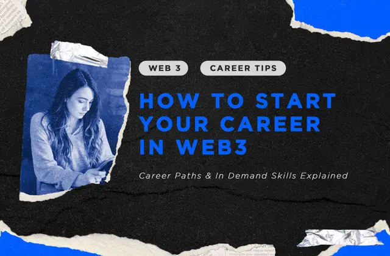

# 如何开启你的Web3/区块链职业生涯 - 职业路径与建议

Web3 可能2024年是最令人兴奋的行业之一，因其快速增长、优厚薪资以及光明前景而备受瞩目。在本文中，我们将详细介绍Web3和区块链领域的不同职业发展路径和机遇，以及相关的职责和技能要求。同时，作为一名在Web3领域经验丰富的招聘顾问，我们还将回答一些关于申请Web3工作的常见问题。

## 什么是Web3？

在开始之前，重要的是要理解Web3是一个庞大的概念，它涵盖了从加密货币（Cryptocurrency）、区块链（Blockchain）、金融科技项目和协议，到去中心化游戏（Decentralized Gaming）、非同质化代币（NFT）和元宇宙（Metaverse）等多个领域。该行业内有众多选择，对于刚开始Web3职业生涯的人来说，从一个领域转向另一个领域并不罕见，最终找到自己最感兴趣的方向。需要注意的是，不同Web3领域的平均薪资水平和技能要求可能存在显著差异。

## 为什么选择区块链或Web3职业路径？

在一个快速发展的行业工作令人兴奋。每个月都有数百家新公司涌现并提供新的工作机会，人才需求持续旺盛。这对求职者来说是一个理想的情况。

根据 Crunchbase 的数据，2024年上半年Web3初创企业的[总融资额达到了37亿美元](https://news.crunchbase.com/web3/venture-funding-crypto-blockchain-q2-2024/)。随着区块链和去中心化工具在我们日常生活中的进一步普及，这一数字还将继续增长。Web3行业的就业机会短期内不会减少，并且大多数岗位也不容易被AI替代。

根据我们为数百个Web3职位招聘的经验，Web3公司通常有以下优势：

- **具有竞争力的薪资**：这些公司资金充足，愿意为合适的人才支付高薪
- **远程工作**：大多数公司提供灵活的远程办公选项
- **年轻的企业文化**：Web3团队通常比较年轻，层级较少，思维开放，工作氛围更好
- **职业发展机会**：初创公司和新兴企业通常更倾向于内部提拔，给员工提供快速晋升的机会

对于年轻和有抱负的求职者来说，这无疑是建立职业生涯的理想环境。不仅如此，在 Web3 行业工作还能近距离接触全球最前沿的技术，并参与可能改变未来的项目。能做令人兴奋的工作并获得丰厚的报酬，岂不美哉?  如果想深入了解，欢迎阅读我们的博客，一起探讨 [Web3 是否是一个良好的职业选择](https://hyphen-connect.com/blog/is-web3-a-good-career)。

## 在Web3找工作难吗？

### 对于优秀人才和有经验的专业人士

根据我们的经验，如果你具备Web3行业急需的核心技能和相关经验，比如编程、数字营销、商务和产品开发或数据分析，那么找到第一份 Web3 工作相对会比较容易。

Web3是一个新兴行业，拥有深厚行业经验的人才非常稀缺。只要有强烈的学习热情和适应能力，许多公司通常愿意聘用来自其他领域的人才。关键在于要突出展现你的可迁移技能和转型决心，让雇主看到你的潜力。

### 对于竞争力较弱的求职者

话虽如此，Web3仍然是一个发展极快且竞争激烈的行业。企业总是在与竞争对手赛跑，因此希望招聘能够立即填补技能空缺的人才。同时，对于不能达到预期业绩水平的员工，也会果断终止雇佣。

如果你的竞争力不足，或者不擅长在快节奏、高压力的环境中工作，那进入web3可能会面临不小的挑战。无论你申请什么职位，都要做好与高水平候选人竞争的准备，并且入职后接受苛刻的 OKR 和 KPI 的考验。

### 对于没有经验的应届毕业生

在web3行业中，中高级岗位远多于初级岗位，导致本就稀缺的初级岗位竞争更加激烈。如果缺乏工作经验或过硬的技能，公司只能通过你的教育背景、作品集和面试表现来评估你的潜力。因此拥有相关实习经历、能够展示 Web3 知识的能力，以及参与过 Web3 相关项目（如黑客松、校园项目等）都会成为你的关键优势。

## 如何开始你的区块链/Web3职业生涯

基于我们招聘和面试数百个Web3职位候选人的经验，以下是一些帮助你在下次面试中脱颖而出的建议：

### 1、能畅谈 Web3

求职者最常犯的错误之一是无法有力的展示出自己对Web3的热情。例如，他们可能说对金融科技和去中心化感兴趣，但却无法讨论具体的话题、趋势，甚至说不出一个自己关注过的 Web3 KOL。

除非你申请的岗位完全不需要任何行业知识，否则下面这些问题很可能会在面试中出现。准备面试时，确保你能对每一个问题都给出好的答案：

- 你关注了哪些Web3 KOL，为什么关注他们？
- 你喜欢哪些Web3产品？ 你觉得他们的成功的原因是什么？
- 你认为哪些Web3项目在未来几年会爆发？为什么？
- 哪些区块链案例和应用让你眼前一亮？为什么？

记住，HR知道你不是从业人员，因此也不会期望你像行业专家一样回答这些问题（尽管这是个加分项），他们希望通过以上问题看到你对web3行业的了解、关注和热情。

### 2、不需要掌握所有的web3知识

如果你来自其他领域，邀请你面试的公司很可能看重的是你在其他领域的专业能力（如营销或设计），而不是你对Web3的了解程度。

除非你找的是需要深厚行业知识的高级或技术性岗位（如营销总监）的工作，否则不要给自己太大压力，试图在几天的时间内掌握Web3的所有知识。相反，将重点放在与你求职的公司和岗位相关的几个Web3主体上。到一个你感兴趣的话题的方向，会学得更快。

例如，如果你正在找一家去中心化游戏公司的营销岗位的工作，可以先玩几款web3游戏，关注一些主要的Web3游戏 KOL，了解游戏和市场趋势。这足够表明你对行业的学习热情，并帮助你顺利通过面试。

### 3、简历仍然很重要

除非你是那种每个科技巨头都争着招聘的编程/营销/业务天才，否则Web3雇主和招聘人员仍然希望看到一份合适的简历，突出与职位相关的技能和经验。如果需要提交作品集，也要进行适当修改，使你的过往项目尽可能的体现相关性。

### 4、LinkedIn 仍然是金矿

如果你正从其他行业转型，完善你的 LinkedIn 个人资料，并开始与Web3社区的人互动。了解适合你的Web3职位以及需要的技能或经验，并在你的个人资料中突出这些内容。许多Web3招聘人员仍然使用 LinkedIn 和类似的招聘平台寻找人才并发布职位空缺。一份出色的个人资料能让你的求职脱颖而出，甚至吸引招聘人员直接邀请你参加面试。

### 5、放下身段，脚踏实地

像区块链架构师或营销总监这样的高级职位通常需要更深入的行业知识和经验。如果你暂时还不具备这些能力，不妨先退一步，申请对新人更友好的职位。Web3是一个快速发展的行业，提供了大量向上发展的机会。保持学习、适应并努力工作，最终一定会实现自己的职业目标。

### 6、主动联系招聘人员

如果你迫切希望进入Web3行业，可以直接联系活跃在Web3领域的招聘人员。例如，在 Hyphen-Connect 始终有[Web3相关的职位空缺](https://hyphen-connect.com/careers)，非常很乐意接收你的简历并为你匹配适合的职位。如果你的个人条件足够有竞争力，大多数招聘人员都很乐意与你建立联系，为你留意合适的岗位，并回答你对职位的疑问，帮助你能更好地准备面试。

## 可以在哪些公司工作？

大多数人都熟悉一些Web3知名公司和公链，如[Coinbase（比特币交易所）](https://www.coinbase.com/)、[OKX（欧易）](https://www.okx.com/)、[Binance（币安）](https://www.binance.com/en)、[Solana（索拉纳）](https://solana.com/)和[Ripple（瑞波）](https://ripple.com/)，但这些并不是唯一的选择。目前全球有数千家Web3公司，其中许多是开发未来可能成为日常工具的技术型初创企业。无论你的背景或技能如何，都可以在以下类型的公司中找到合适的Web3工作机会：

### Web3初创公司/区块链项目

就像智能手机的发明催生了成千上万的应用程序一样，Web3也正在经历类似的趋势。许多公司正在开发利用区块链技术的创新产品。一些公司专注于金融科技解决方案，另一些则关注区块链硬件、web3游戏或 NFT。

### 加密货币交易所

随着全球范围内加密货币交易的增长，中心化交易所（CEX）正在快速扩张。这类公司通常需要营销、公关、网络安全、市场分析、网页设计等方面的人才，以推动其业务在全球范围内增长。

### 研发团队

区块链技术有无数的潜在应用，其中许多尚未被探索。很多研发团队正在积极研究这些可能性，因此技术研究员和研发人才一直供不应求。

### 风险投资公司

风险投资公司寻找有高增长潜力的项目，并在早期阶段投资以获取可观收益。他们需要Web3人才帮助他们分析市场、识别有前景的项目，并为他们投资的初创企业提供支持。

### 传统公司加速布局 Web3

像 Meta、Nike、Microsoft和Visa等全球品牌，正在积极进入Web3领域并扩展相关团队。这一趋势将持续发展，为传统公司带来更多Web3相关的职位机会。

## 技术方向的Web3从业路径

### 区块链/智能合约/Dapp 开发者 

这些开发者专注于区块链架构、共识算法和智能合约。他们的工作涉及创建和管理区块链基础设施，确保其安全性和高效性，以及开发去中心化应用程序（DApp）。

职业发展路径：高级开发者、技术主管、工程总监、CTO

核心技能：
- 熟练掌握编程语言（如 Solidity、Rust、Go、JavaScript、Python 等）
- 深入理解区块链系统和概念
- 熟悉密码学和数据安全原理

### 前端工程师
这些开发者专注于用户端，开发网站、应用程序和界面，让用户能够无缝访问区块链。

职业发展路径：高级开发者、技术负责人（通常转向全栈工程师以获得更好的发展机会）

核心技能：
- 熟练掌握编程语言（如 JavaScript、HTML、CSS）
- 了解区块链系统和概念
- 熟悉密码学和数据安全原理

### 数据分析师
通常专注于解读和利用区块链网络和去中心化应用程序生成的数据。他们的工作涉及分析区块链交易数据、监控网络活动，并提供洞察以优化区块链运营和指导业务决策。

职业发展路径：高级数据分析师、数据科学家、数据分析主管、首席数据官（CDO）

核心技能：
- 熟练使用数据分析工具和编程语言（如 Python、R、SQL）
- 理解区块链技术及其数据结构
- 能够分析大型数据集并提取可操作的洞察
- 熟悉数据可视化工具（如 Tableau、Power BI）
- 掌握密码学和数据安全原理

### 安全专家
区块链安全专家负责识别并降低区块链网络中的安全风险。他们进行安全审计、开发安全协议并应对安全事件。

职业发展路径：安全分析师、高级安全专家、安全工程负责人、首席安全官（CSO）

核心技能：
- 深刻理解区块链安全原理
- 具备使用安全审计工具和技术的经验
- 熟悉网络安全威胁及其应对措施
- 能够开发并实施安全政策和流程

## 商务与金融方向的 Web3 从业路径

### 区块链顾问
区块链顾问为企业提供实施和集成区块链技术的指导，识别合适的用例，并制定利用此技术的策略。

职业发展路径：初级顾问、高级顾问、首席顾问、咨询总监
核心技能：
- 广泛了解区块链技术及其应用
- 出色的沟通和咨询能力
- 能够分析业务流程并识别区块链的增值点
- 熟悉区块链实施中的监管和法律考量

### 去中心化金融（DeFi）专家
DeFi 专家专注于去中心化金融应用，致力于开发支持去中心化借贷、交易和其他金融活动的协议。

职业发展路径：DeFi 分析师、DeFi 项目经理、DeFi 负责人

核心技能：
- 深入了解金融市场及其工具
- 掌握 DeFi 协议及其操作
- 具备风险评估与管理能力
- 能够分析和解释 DeFi 领域的财务数据

### 商务拓展经理
商务拓展经理负责发掘和推进新的商业机会，建立合作伙伴关系，并推动 Web3 领域的战略增长。

职业发展路径：商务拓展代表、商务拓展经理、高级商务拓展经理、商务拓展总监

核心技能：
- 较强的商业头脑和谈判技巧
- 能够识别并追求新商业机会
- 了解区块链技术及其潜在应用
- 理解市场趋势和竞争格局

### 金融分析师
金融分析师分析区块链相关的财务数据，评估投资机会，并提供支持财务决策的见解。

职业发展路径：初级金融分析师、高级金融分析师、金融分析主管、首席财务官（CFO）

核心技能：
- 熟练掌握财务分析和建模
- 了解区块链技术和加密货币市场
- 能够分析大型数据集并提取可操作的洞察
- 熟悉区块链领域的金融法规和合规性

## 设计与动画方向的 Web3 从业路径

### UX/UI 设计师
在 Web3 领域，UX/UI 设计师专注于为去中心化应用（dApp）和区块链平台创造直观且引人入胜的用户体验。他们确保用户能够无缝地与复杂的区块链技术互动。

职业发展路径：初级 UX/UI 设计师、高级 UX/UI 设计师、首席 UX/UI 设计师、设计负责人

关键技能：
- 熟练使用设计工具，如 Sketch、Figma、Adobe XD 和 InVision
- 深刻理解以用户为中心的设计原则和方法
- 有创建线框图、原型和用户流程的经验
- 了解区块链技术及其对用户交互的影响
- 能够进行用户研究和可用性测试，以指导设计决策

### 多媒体设计师
Web3 领域的多媒体设计师负责创建视觉内容，包括图形、视频和动画，以传达复杂的区块链概念，并推广去中心化应用（dApp）。

职业发展路径：初级多媒体设计师、高级多媒体设计师、首席多媒体设计师、创意总监

关键技能：
- 熟练使用多媒体设计工具，如 Adobe Creative Suite（Photoshop、Illustrator、After Effects）
- 深刻理解视觉叙事和动画原理
- 能够为各种平台（包括社交媒体、网站和 dApp）创作引人入胜的内容
- 了解区块链技术及其在视觉传播中的应用要求
- 有视频制作和编辑的经验

### 动画师
Web3 领域的动画师负责开发动画内容，帮助解释和推广区块链技术和去中心化应用（dApp）。他们创建用于教育、营销活动和用户界面的动画。

职业发展路径：初级动画师、高级动画师、首席动画师、动画总监

关键技能：
- 熟练使用动画软件，如 Adobe After Effects、Blender 和 Toon Boom
- 深刻理解动画原理和技巧
- 能够创作简化复杂概念的引人入胜的动画
- 了解区块链技术及其如何在视觉上进行表达
- 有 2D 和 3D 动画经验

## 结语

进入 Web3 行业并不难，关键是拥有合适的技能，并愿意不断学习和适应行业的变化。虽然 Web3 领域目前有许多高薪职位，但竞争依然激烈，雇主对人才的要求也非常高。如果你能够在快节奏和高压环境中保持专注，Web3 的职业路径将会是一个非常适合你的选择。

## 关于 Hyphen Connect

Hyphen Connect 是一家专注于 AI 和 Web3 行业的人才招聘与配置顾问公司，致力于帮助企业找到最优秀的技术人才，打造强大的团队。在忙于为公司寻找到顶尖人才的同时，我们也很乐意分享招聘、人才管理及职业发展的最新动态和实用技巧。

