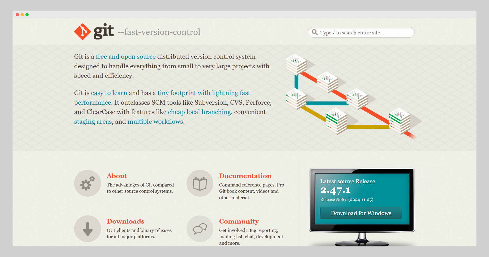
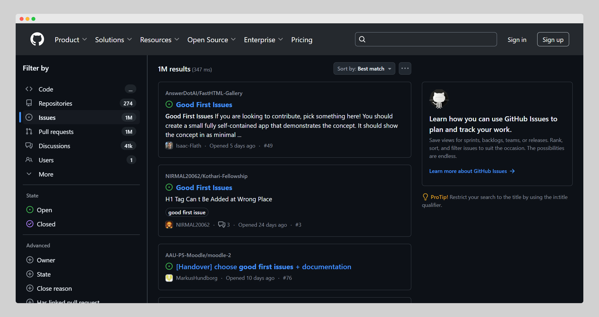
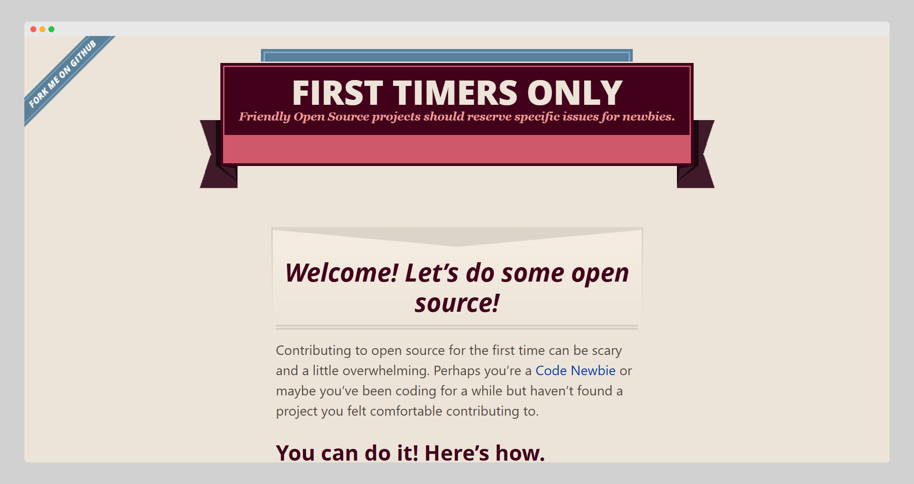
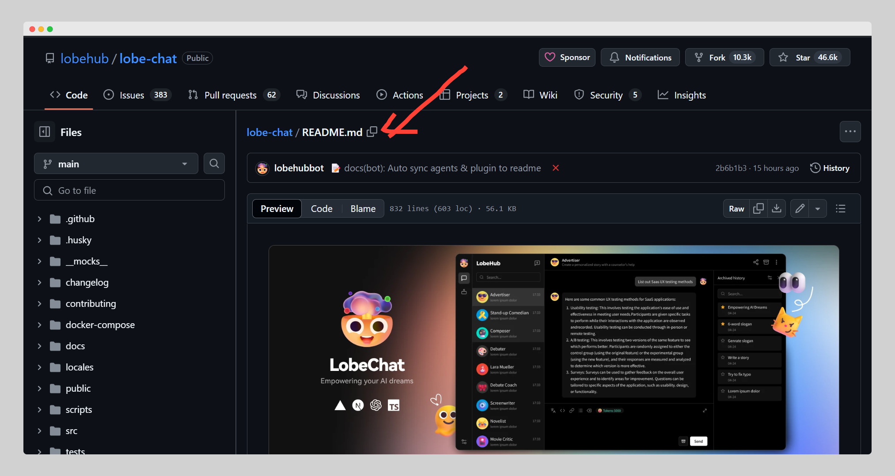
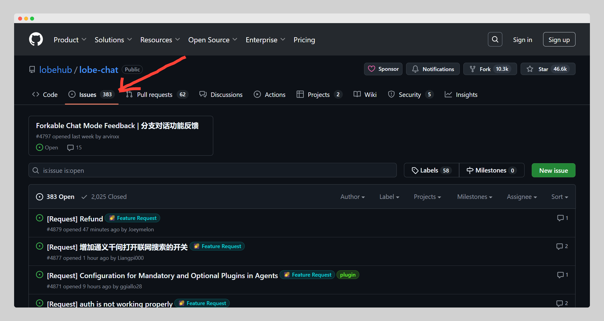
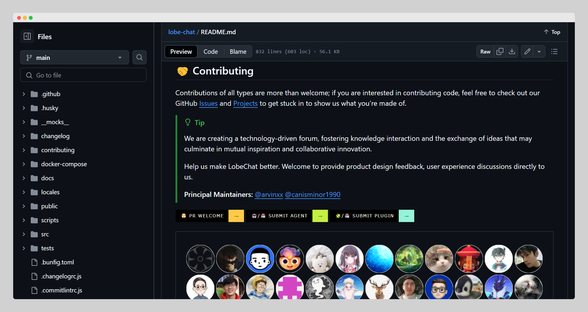
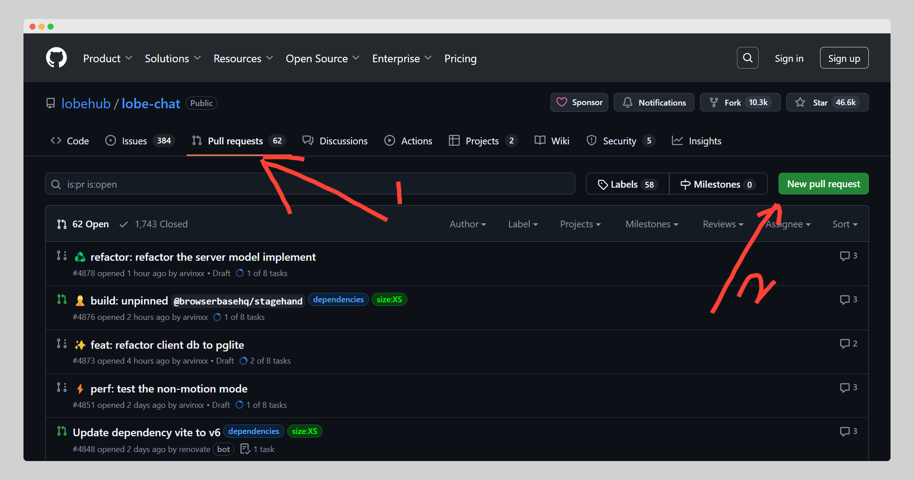

原文： https://www.freecodecamp.org/news/how-to-contribute-to-open-source-projects-as-a-beginner/

作者：Fanny Nyayic  
翻译：Arthur Yeh  
校对：小符   


# 新手如何参与开源贡献

最近，我参加了一个开源峰会，一个意外的发现让我印象深刻。在一次关于社区贡献的小组讨论中，向观众提出了一个问题：“你们中有多少人以前为开源项目做过贡献？” 只有少数人举手。虽然大家对开源的热情令人惊讶，但仍有许多参与者不确定如何迈出贡献的第一步。


## 目录

* [受一次小组讨论的启发](#受一次小组讨论的启发)
* [简介](#简介)
* [什么是开源？](#什么是开源)
* [为开源做贡献的好处](#为开源做贡献的好处)
* [如何开始开源贡献](#如何开始开源贡献)
* [非技术性的开源贡献](#非技术性的开源贡献)
* [结语](#结语)

## 受一次小组讨论的启发

随后的对话揭示了一个共同的主题：许多人感到畏惧，认为只有成为专家级的程序员才能做出有意义的贡献。这次经历激发了我写这本指南的灵感，旨在拆解贡献开源项目的过程，并展示无论技术能力如何，每个人都可以在开源生态系统中发挥重要作用。

## 简介

开源软件是我们每天使用的许多工具和服务的基础。无论是你使用的网页浏览器、计算机操作系统，还是为你喜欢的应用程序提供支持的库，开源项目都对技术领域做出了重要贡献。

然而，作为初学者，参与开源贡献有时可能具有挑战性。许多新人会被开源项目的规模和复杂性所压倒，不确定如何开始或如何做出有意义的贡献。

本文将一步步指导你如何为开源项目做贡献。读完之后，无论你的技能水平如何，你都会具备开始贡献项目所需的知识和信心。

## 什么是开源？

在我们深入讨论如何贡献之前，让我们先明确什么是"开源"。开源（Open Source）软件是指使用允许任何人查看、修改和分发代码的许可证发布的软件。这种协作模式允许从业余爱好者到大公司的任何人都能为项目做出贡献。流行的开源项目包括：

* **Linux**：为许多操作系统提供支持的内核
* **Python**：广泛使用的编程语言
* **React**：用于构建用户界面的JavaScript库
* **Mozilla Firefox**：流行的网页浏览器

这些项目通常托管在 GitHub 和 GitLab 等平台上，贡献者可以在那里提交代码、报告问题和审查更改。

## 为开源做贡献的好处

为开源项目做贡献可以带来诸多好处：

* 技能发展：通过在真实项目上工作，你将学习新的编程语言、工具和最佳实践
* 社区参与：开源项目通常拥有友好的社区，可以帮助你在开发者和个人方面成长
* 人脉建设：当你为开源做贡献时，你将与其他开发者、潜在雇主和技术领域的志同道合者建立联系
* 建立作品集：为开源做贡献是建立作品集和向潜在雇主展示技能的绝佳方式
* 产生影响：你的贡献可以直接影响全球数千用户，帮助改进他人依赖的软件

## 如何开始开源贡献

开始参与开源可以分解为几个可管理的步骤。这些步骤将指导你完成整个过程，从找到要贡献的项目，了解如何做出贡献，到提交贡献供审查。

### 步骤1：设置开发环境

在你能为开源项目做贡献之前，你需要设置本地开发环境。你需要的工具取决于项目使用的语言或技术。以下是适用于大多数项目的基本设置：

1. **Git**：Git是一个版本控制系统，允许你跟踪代码更改并与他人协作。你可以从 [git-scm.com](git-scm.com) 安装 Git。



   安装后，设置你的 Git 用户名和电子邮件：
   ```bash
   git config --global user.name "你的名字"
   git config --global user.email "你的邮箱@example.com"
   ```

2. **GitHub账户**：大多数开源项目托管在 GitHub 上，所以需要在 [github.com](https://github.com/) 创建一个账户。


3. **文本编辑器**：选择一个你将用来编写代码的文本编辑器或 IDE（集成开发环境）。流行的选择包括 [Visual Studio Code](https://code.visualstudio.com/)、[Sublime Text](https://www.sublimetext.com/) 和 [JetBrains IDEs](https://www.jetbrains.com/)。


4. **编程语言**：根据项目需要，你需要安装必要的编程语言。 例如，如果你正在处理 Python 项目，确保你的系统上安装了 Python。

### 步骤2：理解 Git 版本控制

版本控制是开源贡献的基础。Git 允许多个开发者在同一个项目上工作而不会互相干扰。在贡献之前，重要的是要理解以下 Git 概念：

* **仓库（Repository）**：存储项目代码和文件的目录
* **分叉（Fork）**：创建仓库的个人副本，允许你在不影响原始项目的情况下进行更改
* **克隆（Clone）**：将整个仓库复制到本地机器，以便离线工作
* **分支（Branch）**：用于将您的更改与主代码库（通常称为`main`或`master`）隔离
* **拉取请求（Pull Request，PR）**：将你的分支中的更改合并到原始仓库的代码库中的提议

克隆仓库：
```bash
git clone https://github.com/用户名/仓库.git
```

为你的更改创建新分支：
```bash
git checkout -b my-feature-branch
```

### 步骤3：找到要贡献的项目

找到合适的项目是开始的关键。以下是一些寻找欢迎初学者的项目的方法：

1. **GitHub Explore**：GitHub有一个 [Explore](https://github.com/explore) 页面，可以找到热门仓库或按语言或兴趣搜索项目。


2. **Good First Issues**：许多开源项目用"good first issue"标签标记适合初学者的问题。可以通过在 GitHub 或其他平台上搜索“good first issues”来找到这些内容。



3. **开源社区**：像 [First Timers Only](https://www.firsttimersonly.com/) 和 [Up For Grabs](http://up-for-grabs.net/) 这样的网站列出了正在积极寻找新手贡献者的开源项目。



4. **查看文档**：寻找文档完善的项目。文档完善的项目更有可能指导你完成贡献过程。

例如，如果你是一名 Python 开发人员，就可以为 Python 文档本身或 Requests 、 Flask 或 Django 等项目库做出贡献。
 

### 步骤4：了解项目

一旦你找到了感兴趣的项目，下一步是熟悉它。

1. **阅读README**：项目的 README 文件是你应该首先查看的地方。它提供项目概述、如何设置以及通常概述贡献指南。



2. **检查问题**：查看项目 GitHub 仓库中的问题。问题通常是追踪错误、功能请求或任务的地方。寻找标签为`good first issue`或`beginner-friendly`的问题。



3. **本地设置项目**：克隆仓库并在本地机器上设置项目，确保一切按 README 中描述的那样工作。例如，如果你正在开发 Python 项目，可能需要通过 **pip** 安装依赖项:

```bash
pip install -r requirements.txt
```

4. **阅读贡献指南**：许多项目都有贡献指南。这些指南可能涵盖编码风格、测试要求以及如何格式化提交消息等内容。



### 步骤5：做出你的第一个贡献

现在来到有趣的部分，开始贡献！以下是具体步骤：

1. **分叉仓库**：在 GitHub 上，点击"Fork"按钮创建项目的个人副本。



2. **克隆你的分叉**：将你的分叉克隆到本地机器：
   ```bash
   git clone https://github.com/你的用户名/仓库.git
   ```

3. **创建新分支**：为每个贡献创建新分支是良好实践：
   ```bash
   git checkout -b my-branch
   ```

4. **做出更改**：现在，做出你想贡献的更改。例如，如果你在修复bug，你可以编辑相应的文件中的代码。如果你要更新文档，可以编辑 **README.md** 。
	
	假如你正在修复 **README.md** 文件中的拼写错误：
	```bash
	# Incorrect text
	This is a sampe of a typo.
	```
	可以修改为：
	```bash
	# Corrected text
    This is an example of a typo.
	```

5. **提交你的更改**：一旦做出更改，用清晰、简洁的消息提交它们：
   ```bash
   git add .
   git commit -m "修复README中的错别字"
   ```

6. **推送你的更改**：将更改推送到GitHub上的分支：
   ```bash
   git push origin my-branch
   ```

### 步骤6：提交拉取请求（PR）

现在你的更改已推送到 GitHub，是时候提交它们供审查了。

1. **转到原始仓库**：导航到原始仓库（不是你的分支）。


2. **创建拉取请求**：GitHub通常会显示一个横幅，建议你的分支已准备好创建拉取请求。点击"Compare & pull request"按钮。

3. **写描述**：清楚地描述你做了什么以及为什么。具体说明你的更改解决了什么问题。

一旦提交了拉取请求，项目维护者将审查你的更改。他们可能会要求修改或批准你的更改。

### 步骤7：回应反馈

维护者可能会对你的拉取请求提供反馈。确保及时回应。如果他们要求更改，在本地进行更改，提交它们，并推送到你的分支。

例如：
```bash
git commit --amend
git push --force
```

一旦更改获得批准，你的拉取请求将被合并到主项目中。

## 非技术性的开源贡献

虽然技术贡献如编码通常与开源项目相关，但还有许多有价值的方式可以做出不需要编程技能的贡献。

### 1. **文档**
清晰、全面的文档对任何开源项目都至关重要，但经常被忽视。作为非技术贡献者，你可以改进或编写项目文档，使新用户和贡献者更容易理解和使用软件。

* 改进README：明确设置说明、使用示例和安装过程
* 编写教程：创建帮助初学者入门的分步指南或视频教程
* 修正错别字：纠正现有文档中的拼写、语法和格式错误

### 2. **社区支持和参与**
许多开源项目依靠充满活力的社区来蓬勃发展。为社区做贡献可以包括回答问题、管理讨论和为新用户提供支持。

* 帮助在GitHub问题或社区论坛中遇到问题的用户解答问题
* 确保论坛、邮件列表或社交媒体上的讨论具有建设性并切题
* 编制常见问题及其答案，帮助用户解决常见问题

### 3. **设计和用户界面（UI）贡献**
项目经常需要帮助使其用户界面在视觉上吸引人且易于使用。如果你有设计背景，你可以通过创建模型、改进布局或提出UI/UX改进建议来做出贡献。

* 为项目设计标志、图标或插图
* 创建线框图或提供如何使界面更直观易用的建议

### 4. **项目翻译**
使开源项目对全球受众可访问至关重要。将项目内容翻译成不同语言可以帮助非英语用户使用和贡献项目。

* 将项目文档转换成其他语言以扩大用户群
* 使软件界面、错误消息或网站适应不同地区和文化

### 5. **营销和推广**
开源项目需要被新用户和贡献者发现，这就是营销发挥作用的地方。非技术贡献者可以通过各种渠道帮助提高项目知名度。

* 在Twitter、LinkedIn、Facebook和其他平台上分享有关项目的帖子、更新和亮点
* 撰写关于项目、如何使用它或它如何解决特定问题的文章
* 制作视频教程或博客文章，教新用户如何使用或为项目做贡献

### 6. **活动组织和筹款**
组织活动或筹集资金对开源项目的可持续性至关重要。非技术贡献如活动策划或财务支持可以产生重大影响。

* 帮助组织社区活动、编程马拉松或会议，将开发者和用户聚集在一起
* 协助筹款工作，通过众筹活动或补助金申请确保项目的财务未来

### 7. **质量保证（QA）和测试**
虽然测试软件听起来像是一项技术任务，但非开发人员可以通过测试可用性和报告问题来提供帮助。非技术用户可以对项目的用户体验提供宝贵的反馈。

* 识别和报告在使用软件时遇到的错误或问题
* 对软件的易用性提供反馈并建议改进方案

### 8. **法律和许可贡献**
开源项目经常需要在许可证、服务条款和确保项目遵守相关法律等法律方面的帮助。

* 确保项目已正确获得许可并符合相关开源许可证要求
* 协助创建贡献者协议或其他保护贡献者和项目的法律文件

这些非技术贡献对开源项目的成功至关重要，而且经常被认为只有技术技能才能贡献的初学者所忽视。开源社区靠协作而繁荣，非技术贡献者在培养这种精神方面发挥着重要作用。

## 结语

为开源项目做贡献是一个有益的经历，可以帮助你成长为开发者，与志同道合的人建立联系，并在软件世界中产生影响。

记住，每个贡献者都是从某处开始的。如果你的第一次贡献很小，或者在这个过程中遇到挑战，不要灰心。开源社区热情欢迎你的参与，你贡献得越多，学习和成长就越多。
